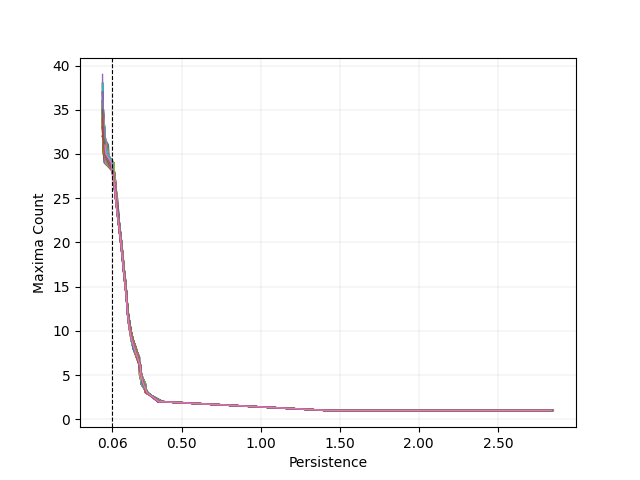
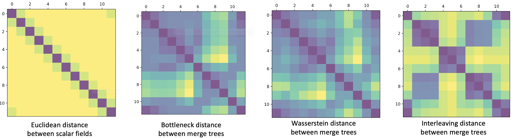
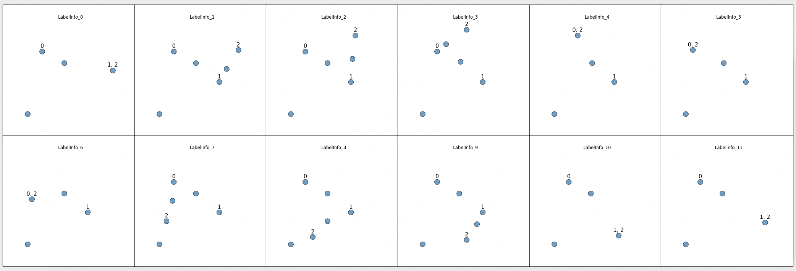

# MergeTreeMetric

This is a Python implementation of computing pairwise distance matrices for time-varying data. These matrices are calculated using four metrics: bottleneck distance, Wasserstein distance, and labelled interleaving distance between two merge trees, and Euclidean distances between scalar fields.

The implementation is described in "Geometry Aware Merge Tree Comparisons for Time-Varying Data with Interleaving Distances" (under review).


- [Installation](#installation)
- [Features](#features)
- [Usage](#usage)
- [Citation](#citation)
- [License](#license)

## Installation

Tested with Python 2.7&3.7, TTK 0.9.8, Paraview 5.6.1, MacOS and Linux.

### Dependencies

1. Python packages

- [NumPy](https://numpy.org/)
- [SciPy](https://www.scipy.org/)
- [NetworkX](https://networkx.github.io/)
- [Matplotlib](https://matplotlib.org/) 
- [VTK](https://vtk.org) 

If you do not have these packages installed, please use the following command to intall them.

```bash
$ pip install numpy
$ pip install scipy
$ pip install networkx
$ pip install matplotlib
$ pip install vtk
```

2. TTK and Paraview

- We need TTK and Paraview to calculate the merge trees from scalar fields. Please following this [link](https://topology-tool-kit.github.io/installation.html) to install both TTK and Paraview.

- After installation of TTK and Paraview, adding environment variable for pvpython in whatever file you normally configure these (e.g. ~/.bash_profile):
```bash
export PV_PLUGIN_PATH="/PATH/TO/PVPYTHON"
```

3. Hera

- We use Hera to calculate bottleneck distance and Wasserstein distance between two persistence diagrams. Please following this [link](https://github.com/grey-narn/hera) to install Hera.

- Adding environment variables in whatever file you normally configure these (e.g. ~/.bash_profile):
```bash
export PATH="/PATH/TO/hera/wasserstein/build"
export PATH="/PATH/TO/hera/bottleneck/build"
```

### Installation

```bash
$ git clone https://github.com/tdavislab/MergeTreeMetric.git
$ cd MergeTreeMetric
$ python MergeTreeMetric.py [dir to files] [Name of scalar field] [Mapping Strategy: TD/ED/ET/MP]
 [Extending Strategy: dmyLeaf/dmyVert] [Tree Type: jt/st] [Glabal or Pairwise Mapping: GM/PM] 
 [Skip merge tree and morse smale calculation] [Output labelling result for global mapping] 
 [threshold for simplification (optional)]
```

## Features
```bash
$ python MergeTreeMetric.py [Path to files] [Name of scalar field] [Mapping Strategy: TD/ED/ET/MP]
 [Extending Strategy: dmyLeaf/dmyVert] [Tree Type: jt/st] [Glabal or Pairwise Mapping: GM/PM] 
 [Skip merge tree and Morse complex calculation] [Output labelling result for global mapping] 
 [threshold for simplification (optional)]
```

#### Parameters

- **\[Path to files\]**
  - Path to the folder of time-varying dataset.
  - Each data file should has an index in filename to specify the time step.
  - Acceptable format of time-varying data: ".vtp" and ".vti"
 
- **\[Name of scalar field\]**
  - The name of attribute for computing merge tree. 

- **\[Mapping Strategy: TD/ED/ET/MP]**
  -  Labelling strategy selecting from TD (tree distance mapping), ED (Euclidean distance mapping), ET (hybrid mapping), and MP(Morse mapping)
  - If select hybrid mapping, you will need to enter  for hybrid mapping. 
  
- **\[Extending Strategy: dmyLeaf/dmyVert\]**
  - Select strategy from dmyLeaf (dummy leaves) and dmyVert (dummy vertices) to create dummy labels.
  
- **\[Tree Type: jt/st\]**
  - Select the type of merge tree from jt (join tree) and st (split tree).
  
- **\[Glabal or Pairwise Mapping: GM/PM\]**
  - Select strategy for pivot tree selection from GM (time-varying pivot tree for global mapping) and PM (pivot-free strategy for pairwise mapping).
 
- **\[Skip merge tree and Morse complex calculation\]**
  - You can skip merge tree and morse smale calculation when you already have them, and just want to change parameters for computing interleaving distance.
  - 1 means skip, and 0 means do not skip.
  
- **\[Output labelling result for global mapping\]**
  - If you are curious about the labelling results for each tree, you can set this to be 1.

- **\[threshold for simplification (optional)\]**
  - You can specify the threshold for simplification directly.
  - Otherwise, this code will plot persistence curves for time-varying data, and require you to choose threshold based on persistence curve.
  <center></center>
  
### Output

- Pairwise distance matrices for time-varying data
  - Under "/Path/To/Files/Output/DistanceMatrices/".
  - Format: n by n matrix, where n is the number of instances.
  
- Critical points responsible for interleaving distance between adjacent data instances
  -  Under "/Path/To/Files/Output/Diagnose/visTrans_*".
  - "visBackTrans_i.vtp" shows the critical point from instance i, that is responsible for the interleaving distance between   and   
  - "visTrans_i.vtp" shows the critical point from instance i, that is responsible for the interleaving distance between   and   .
  
- Persistence curve and threshold for simplification
  - Under "/Path/To/Files/Output/Figures/".
  
- Labeling results
  - Under "/Path/To/Files/Output/LabelInfo/".
 
### Intermediate files
You can find merge trees (VTK and TXT format), persistence curves, persistence diagrams of merge trees, and vectors of scalar field under "/Path/To/Files/IntermediateFiles".
 
## Usage
 
 You can get the Fig. 6 from paper (under review), using the following command. And you will need to set lambda to be 0.5 and simplification to be 0.02 during the running of program.
```bash
$ python MergeTreeMetric.py ./data/MovingGaussian/ Scalars_ ET dmyLeaf st GM 0 0
```

There is an example to plot pairwise distance matrices:
```bash
$ python plotMatrix.py ./data/MovingGaussian/
```
 <center></center>

We also provide an example to plot labelling results:
```bash
$ python plotLabels.py ./data/MovingGaussian/
```
You can find figures under "/Path/To/Files/Output/Figures/LabelInfo/"

 <center></center>
